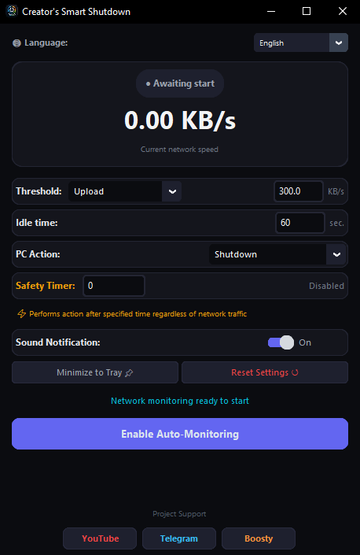

# 💻 Smart Shutdown

**Smart Shutdown** is a Windows utility that monitors network activity and automatically performs a selected system action when downloads or network traffic are finished.

The program can automatically:

* Shut down the computer
* Put the computer into Sleep or Hibernate mode
* Restart the computer
* Execute an action using a safety timer
* Play a sound notification
* Run in the system tray
* Save user settings
* Use multiple interface languages

> ⚠️ Smart Shutdown controls Windows system actions. Always check your settings and make sure that all important files are saved before starting automatic monitoring.

---

## 🌟 Features

### 📡 Network Activity Monitoring

Smart Shutdown monitors the current data transfer speed through the computer's network interfaces.

Two monitoring directions are available:

* **Upload** - outgoing data transfer
* **Download** - incoming data transfer

When the network speed remains below the selected threshold for a specified period of time, the program detects reduced activity and starts the selected system action.

---

### ⚙️ Configurable Network Threshold

You can set the network activity threshold below which the connection will be considered inactive.

Example:

```text
Threshold: 300 KB/s
Idle time: 60 seconds
```

If the network speed remains below the selected threshold for the specified time, Smart Shutdown starts the configured action.

---

### 🖥️ Available System Actions

Smart Shutdown supports the following actions:

* Shut down
* Sleep / Hibernate
* Restart

A safety delay is used before shutting down, sleeping, or restarting Windows.

---

### ⏱️ Safety Timer

The built-in safety timer allows you to execute the selected action after a specified amount of time, regardless of current network activity.

The timer can be disabled.

```text
0 = Timer disabled
```

This feature is useful when:

* A download becomes stuck
* Network activity stops unexpectedly
* You want to shut down the computer after a fixed period of time
* You need an additional safety limit

---

### 🔊 Sound Notification

After monitoring is completed and before the selected system action is executed, Smart Shutdown can play a sound notification.

Sound notifications can be enabled or disabled in the settings.

---

### 📌 System Tray Support

When the required additional libraries are available, Smart Shutdown can run in the Windows system tray.

The tray menu provides the following actions:

* Show the main window
* Exit the application

---

### 💾 Settings Persistence

User settings are saved in the following file:

```text
window_config.json
```

Saved settings include window parameters and application preferences.

---

### 🌍 Multilingual Interface

Smart Shutdown supports the following interface languages:

* English
* Русский
* Español
* Deutsch
* Français
* 中文
* Português
* 日本語

---

## 📥 Download

### Recommended: Portable EXE Version

For regular users, the easiest way to use Smart Shutdown is to download the portable Windows executable from the Releases page.

👉 **[Download Smart Shutdown from GitHub Releases](https://github.com/cybercraftt/Smart-Shutdown/releases)**

The portable version:

* Requires no installation
* Does not require Python
* Does not require additional dependencies
* Can be launched directly from the downloaded `.exe` file

### How to Run

1. Open the [Releases](https://github.com/cybercraftt/Smart-Shutdown/releases) page.
2. Download the latest portable `.exe` file.
3. Run the downloaded file.
4. Configure the network monitoring settings.
5. Start monitoring.

> ⚠️ Windows SmartScreen or antivirus software may display a warning because the executable may not have a digital signature. Only run the file downloaded from the official project repository.

---

## 🖼️ Screenshot



---

## 💻 System Requirements

### Portable EXE Version

* Windows 10 or Windows 11
* No Python installation required
* No additional dependencies required

### Developer Version

To run the source code directly, you need:

* Windows 10 or Windows 11
* Python 3.11 or newer
* `pip`
* Windows Command Prompt or PowerShell

When installing Python, make sure to enable:

```text
Add Python to PATH
```

---

## 📂 Project Structure

```text
Smart-Shutdown/
│
├── smart_shutdown.py
├── requirements.txt
├── README.md
├── LICENSE
│
└── assets/
    └── screenshot.png
```

### File Description

| File                    | Description                  |
| ----------------------- | ---------------------------- |
| `smart_shutdown.py`     | Main application source code |
| `requirements.txt`      | Python dependencies          |
| `README.md`             | Project documentation        |
| `LICENSE`               | Project license              |
| `assets/screenshot.png` | Application screenshot       |

---

## 🛠️ Run from Source

This section is intended for developers.

### 1. Clone the Repository

```bash
git clone https://github.com/cybercraftt/Smart-Shutdown.git
```

Enter the project directory:

```bash
cd Smart-Shutdown
```

You can also download the project archive using:

```text
Code → Download ZIP
```

Extract the archive into a convenient folder.

---

### 2. Install Dependencies

Open Command Prompt or PowerShell in the project directory and run:

```bash
pip install -r requirements.txt
```

If the `pip` command does not work, use:

```bash
python -m pip install -r requirements.txt
```

---

### 3. Run the Application

```bash
python smart_shutdown.py
```

The Smart Shutdown graphical interface will open.

---

## 📦 Dependencies

The project uses the following Python libraries:

```text
psutil
customtkinter
pystray
pillow
```

You can install them manually:

```bash
pip install psutil customtkinter pystray pillow
```

### Library Description

| Library         | Purpose                                |
| --------------- | -------------------------------------- |
| `psutil`        | Monitoring network activity            |
| `customtkinter` | Modern graphical user interface        |
| `pystray`       | System tray integration                |
| `pillow`        | Image processing and tray icon support |

The Windows modules `winsound` and `ctypes` are included in the Python standard library.

---

## 📦 Build the EXE

To create your own standalone Windows executable, install PyInstaller:

```bash
pip install pyinstaller
```

Build the application:

```bash
pyinstaller --onefile --noconsole smart_shutdown.py
```

The generated file will be placed in:

```text
dist/
```

Usually, the executable will be located at:

```text
dist/smart_shutdown.exe
```

### Build with an Icon

If the project contains an `icon.ico` file, use:

```bash
pyinstaller --onefile --noconsole --icon=icon.ico smart_shutdown.py
```

---

## ⚙️ How to Use

### Step 1 - Launch the Application

Open Smart Shutdown using either:

* The portable `.exe` file
* Python source code

---

### Step 2 - Select the Traffic Direction

Choose which type of network activity should be monitored:

* **Upload**
* **Download**

---

### Step 3 - Set the Network Threshold

Specify the network speed below which the connection will be considered inactive.

Example:

```text
300 KB/s
```

---

### Step 4 - Set the Idle Time

Specify how many seconds the network speed must remain below the threshold.

Example:

```text
60 seconds
```

---

### Step 5 - Select a System Action

Available actions:

* Shut down
* Sleep / Hibernate
* Restart

---

### Step 6 - Configure the Safety Timer

Set the amount of time after which the action will be executed regardless of network activity.

Set the value to:

```text
0
```

to disable the safety timer.

---

### Step 7 - Start Monitoring

Click the monitoring start button.

Smart Shutdown will begin checking the selected network activity.

---

### Step 8 - Cancel a Scheduled Action

If a system action has already been scheduled, use the cancel button in the application.

This allows you to cancel a pending shutdown, restart, or other supported action when possible.

---

## 🧠 How It Works

The simplified workflow is:

```text
Launch Smart Shutdown
        │
        ▼
Configure monitoring settings
        │
        ▼
Start network monitoring
        │
        ▼
Check current network speed
        │
        ▼
Is the speed below the threshold?
        │
   ┌────┴────┐
   │         │
  No        Yes
   │         │
   │         ▼
   │   Check idle time
   │         │
   │         ▼
   │   Has the idle time
   │   been reached?
   │         │
   │    ┌────┴────┐
   │    │         │
   │   No        Yes
   │    │         │
   └────┘         ▼
           Start selected action
           after the safety delay
                   │
                   ▼
          Shutdown / Sleep /
               Restart
```

---

## 🛡️ Cancel a Scheduled Action

Before executing a system action, Windows uses a safety delay.

If an action was started by mistake, use the cancel button in the Smart Shutdown interface.

Windows scheduled shutdown actions can be cancelled using:

```cmd
shutdown /a
```

> Note: Cancellation depends on the action type and the current state of Windows.

---

## 🧪 Example Configuration

To automatically shut down the computer after a download has finished, use settings similar to these:

```text
Direction: Download
Threshold: 300 KB/s
Idle time: 60 seconds
Action: Shutdown
Safety timer: 0
Sound notification: Enabled
```

With this configuration, Smart Shutdown monitors incoming data and starts shutting down the computer when the network speed remains below the selected threshold for the configured idle period.

---

## ❗ Troubleshooting

### Error: `python is not recognized`

If you see:

```text
'python' is not recognized as an internal or external command
```

Python may not be added to the system PATH.

#### Solution

1. Reinstall Python.
2. Enable the following option during installation:

```text
Add Python to PATH
```

3. Complete the installation.
4. Restart Command Prompt or PowerShell.

---

### Error: `pip is not recognized`

Try using:

```bash
python -m pip install -r requirements.txt
```

---

### Error: Missing Python Module

If you see an error such as:

```text
ModuleNotFoundError
```

Install the required dependencies:

```bash
pip install -r requirements.txt
```

You can also install the libraries separately:

```bash
pip install psutil
pip install customtkinter
pip install pystray
pip install pillow
```

---

### System Tray Does Not Work

System tray support depends on the following additional libraries:

```text
pystray
pillow
```

Install them using:

```bash
pip install pystray pillow
```

Then restart the application.

---

## ⚠️ Important Notes

* Smart Shutdown is designed for Windows.
* Save all important documents before starting automatic actions.
* Check the selected monitoring direction before starting.
* A threshold that is too low may cause the action to start earlier than expected.
* A short idle time may trigger the action during a temporary network pause.
* The safety timer can execute the selected action regardless of network activity.
* Test your settings manually before using the application permanently.
* Do not use settings whose purpose you do not understand.
* The portable EXE version does not require Python or manual dependency installation.

---

## 🔐 Security

Smart Shutdown is an open-source project. The source code can be reviewed before running the application.

The main source file is:

```text
smart_shutdown.py
```

Before using the application, it is recommended to:

* Review the source code.
* Check the installed dependencies.
* Download the application from the official repository.
* Test the application on your own computer.
* Make sure that important files are saved before automatic shutdown or restart.

---

## 📄 License

The project license should be specified in the `LICENSE` file.

If you want to allow free use, modification, and distribution of the source code, you can add an appropriate license, such as the MIT License.

After adding a license, update this section accordingly.

---

## 🤝 Support the Project

If Smart Shutdown is useful to you, you can support the project by following the author:

* **YouTube:** [CyberCraft](https://www.youtube.com/channel/UCcGfKjP4XdfkLokNgVOIAyA)
* **Telegram:** [CyberCraftLab](https://t.me/CyberCraftLab)
* **Boosty:** [Support the project](https://boosty.to/cyber_craft)

---

## ⭐ Support Smart Shutdown

If you find Smart Shutdown useful:

* ⭐ Star the repository
* Report bugs through **Issues**
* Suggest improvements through **Pull Requests**
* Share the project with other users

---

## 📌 Project Status

```text
Version: 1.0.0
Status: First Release
Platform: Windows 10 / 11
Type: Portable Windows Application
Language: Python
```

---

## 👨‍💻 Author

**CyberCraft**

Smart Shutdown is a Windows utility designed to automate system actions after network activity has decreased or downloads have finished.
